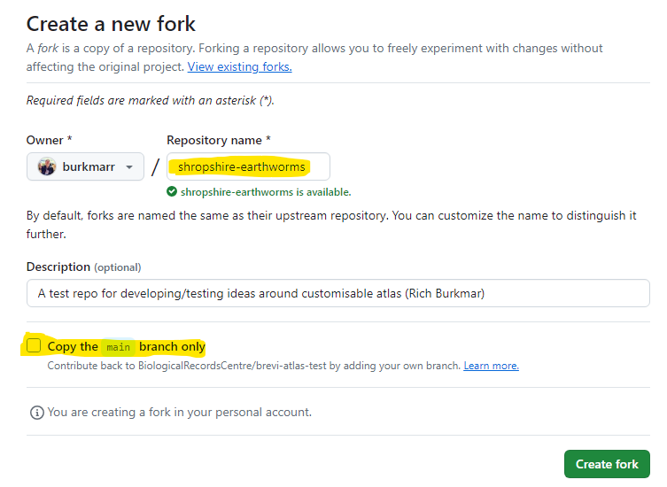
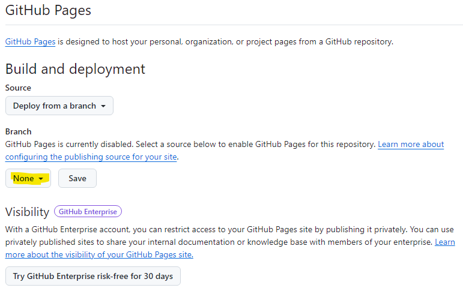
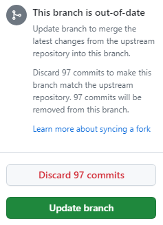

# GitHub setup
The page will take you through the initial steps of creating your own atlas website from the BRC GitHub repository by forking the repository and linking it to a GitHub pages site.

## Personal GitHub account
To use this workflow, you will need a personal GitHub account. GitHub is a platform for hosting and versioning digital resources - commonly software code. It has a whole host of useful features - some of which are described below. If you do not already have a GitHub account, you can set one up here: https://github.com/

You should see up a *free* account - you do not need to sign up for a plan that has costs. The free plan has all the features you need to set up a configurable atlas with this project.

## A note on GitHub and Git vocabulary
GitHub is an online platform built around Git and uses the vocabulary of Git. We will inevitably need to use some of this vocabulary. These terms will be explained as they are introduced below.

(You should only need to use the online GitHub interface to do everything described here. But for those that know, or are prepared to learn, the Git command line interface, it can make things easier when configuring your website, particularly if you have a very large number of taxa in your project.)

## Forking the BRC atlas repo
The first task is to 'fork' the BRC configurable atlas 'repo'. The term 'repo' is short-hand for 'repository' which you can think of as a place that holds all the digital resources related to a project - in this case the configurable atlas project. When you 'fork' a GitHub repo, you copy it to your own GitHub account. But it is a smart copy - GitHub retains and manages the link between the original and your forked copy and provides tools to help you keep them in line.

First go to the BRC repo for the atlas project here: https://github.com/BiologicalRecordsCentre/brevi-atlas-test.

Somewhere towards the top-right of this page your should see a bunch of buttons which look something like this:

You need to click the *fork* button. Then you will see a dialog like that shown below:

Fill in a name for your forked repo - its a good idea to relate it to you altas project because it will appear in the URL of your GitHub Pages website. You also need to *uncheck* the checkbox which says *Copy the main branch only* because major versions of the software will be stored in their own branches. When you have done those things, click the green *Create fork* button.

Once the repo is forked, you will see an identical copy of the BRC configurable atlas repo in your own new repo.

Note that you can only fork any particular project once into your personal account, so it is not possible for you to create more than one configurable atlas into a single GitHub account.

## Setting up a GitHub Pages linked to your repo
The *GitHub Pages* facility is the thing which enables you to publish an actual publicly accessible website on the GitHub platform. Here's how you set up your GitHub Pages linked this your forked repo. 

Near the top-left of the main page for your forked GitHub repo you will see a bunch of buttons like this:

Click the *Settings* button and a dialog will appear with a bunch of links down the left-hand side. Under *Code and automation* you will see the *Pages* link. Click on this link. That will you to a GitHub pages view like this one:

Click the button initially labelled *None* and in the drop-down list of 'branches' which appears, select the latest branch (e.g. v1.0.0). You do not need to change any other controls on this dialog. Click on the *Save* button.

(GitHub/Git branches are a way of storing different versioned copies of the project files. BRC will use this to separate major versions of the configurable atlas project. Normally the 'main' branch will reflect the latest release branch.)

Initially after you've saved your configuration the GitHub pages view looks much the same. The excoption is that there is a section on supplying a custom domain for your GitHub pages website. We will not cover that in this tutorial - we will instead stick with the  domain and URL that GitHub provides for our website. But what is it? Read on.

When GitHub Pages is first linked to your repo - or later when you update the repo with your own configuration files - there is a delay before the GitHub pages is created or updated. This is usually only a few minutes. After a few minutes, try refreshing this page and eventually you will see something like the following appear at the top of the page:

This shows the URL for the website based on the forked GitHub repo. Following that link for the first time will show something like this:

This is how a configurable atlas website looks without any configuration! Your next steps will be to add configuration and data to your repo. You can start learing out this by reading this document on [using GitHub to add/edit files](./docs-add-edit-config.md).

## Updating your project with the latest code
From time to time, BRC may update the configurable atlas software. Because GitHub maintains a link between a forked repo and its source, it is relatively easy to pull those updates into your forked repo. 

On the home page of your forked repo, you may see a notice like the one shown below. It indicates two things:

1. that this branch (i.e. your forked repo) is a number of commits *ahead* of BRC's project site (from which it is forked) and
2. that this branch is a number of commits *behind* of BRC's project site.

The *commits ahead* are generated whenever you make configuration changes to your forked repo. These changes will never be propagated to the project repo, so we can expect this number to continue to grow during the lifetime of your project.

The *commits behind* are important - they indicate software updates that have been made to BRC's project site but which are not yet in your forked repo.

Here's how you can update your forked repo with the latest software updates from BRC's project site. First click on the *Sync fork* button and the following dropdown will apear:

Now click on the *Updated branch* button. Your project will be update with the latest software from the BRC. *Note that it can take a few minutes before these changes are propagated to your GitHub pages website.* 

That's how easy it is to update your project with the latest software.

Note that you will never need to use the *Contribute* button. That would open a 'pull request' on the BRC project to update it with your project's configuration files. If you do this by mistake, the BRC project administrator will just delete your pull request. (Note that genuine project contributors who are aiming to contribute new code to the project will use this contribution method, but this is obvious to the BRC project administration from the files that have been altered in the pull request.)